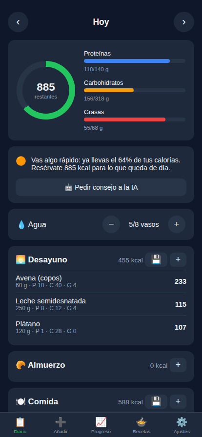
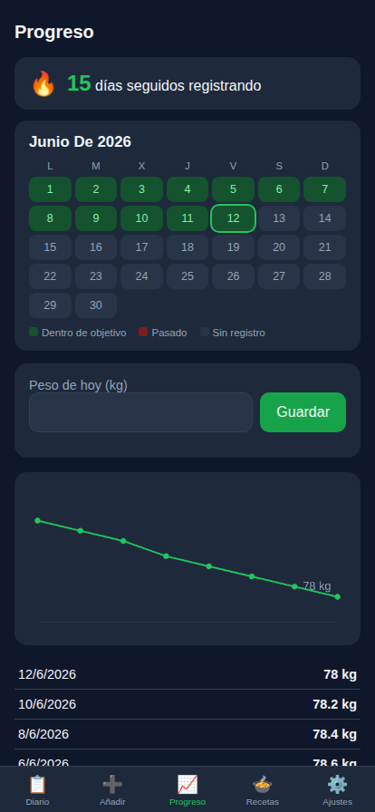
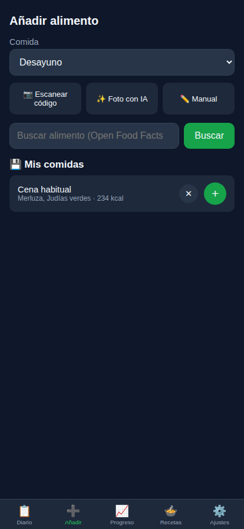
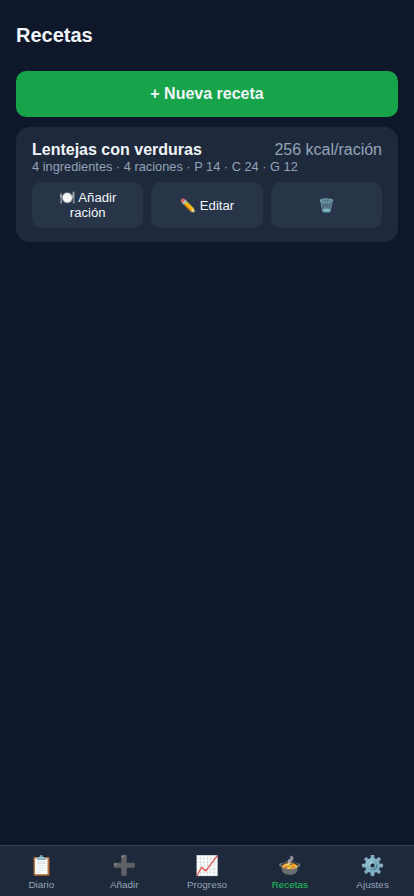

# 🥗 Calorías

**Contador de calorías y macros, gratis y privado. Sin cuentas, sin anuncios, sin servidores: tus datos nunca salen de tu teléfono.**

### [▶️ Abrir la app](https://raulseoanealvarez-collab.github.io/calorias-app/) · [👀 Ver demo con datos de ejemplo](https://raulseoanealvarez-collab.github.io/calorias-app/?demo=1)

---

## 📱 Capturas

| Diario | Progreso | Añadir | Recetas |
|:---:|:---:|:---:|:---:|
|  |  |  |  |

## ✨ Funciones

### Registro de comidas
- 🔍 **Buscador doble**: base local de ~150 alimentos frescos españoles (funciona sin internet) + [Open Food Facts](https://world.openfoodfacts.org) con más de 3 millones de productos envasados
- 📷 **Escáner de códigos de barras** con la cámara — la misma base de datos que usa Yuka
- ✨ **Foto con IA**: fotografía tu plato y la IA identifica los alimentos con gramos, calorías y macros (Claude o Gemini)
- 💾 **Plantillas**: guarda tu cena habitual y añádela entera con un toque
- ⟳ **Repetir ayer**: copia cualquier comida del día anterior con un botón
- ⭐ **Frecuentes** y **ración habitual**: recuerda lo que más comes y cuántos gramos sueles ponerte

### Objetivos y seguimiento
- 🎯 **Objetivos automáticos** según tu perfil con la fórmula Mifflin-St Jeor (ajustables a mano)
- 📋 **Diario** con anillo de calorías, barras de proteínas/carbohidratos/grasas y 6 comidas
- 💡 **Consejos automáticos** según la hora del día: si te pasas, si te quedas corto, si te falta proteína o agua
- 🤖 **Consejo de la IA**: pide recomendaciones personalizadas sobre lo que llevas comido
- 🔥 **Racha** de días registrando y **calendario mensual** de cumplimiento
- 📈 **Peso** con gráfica de evolución y resumen semanal de calorías
- 💧 Contador de **vasos de agua**
- 🍲 **Recetas** propias con cálculo automático de calorías por ración

### Privacidad y datos
- 🔒 **Cero servidores**: todos tus datos viven en tu dispositivo (localStorage)
- 📦 **Exportar/importar** copia de seguridad en JSON
- 📴 **Funciona offline** una vez instalada (service worker)

## 📲 Instalación

La app se instala desde el navegador, sin tiendas de aplicaciones:

**iPhone/iPad** — Abre [la app](https://raulseoanealvarez-collab.github.io/calorias-app/) en **Safari** → botón **Compartir** → **"Añadir a pantalla de inicio"**

**Android** — Abre [la app](https://raulseoanealvarez-collab.github.io/calorias-app/) en **Chrome** → menú **⋮** → **"Añadir a pantalla de inicio"**

**Ordenador** — Funciona en cualquier navegador moderno; en Chrome/Edge puedes instalarla con el icono ⊕ de la barra de direcciones

## 🤖 Activar la IA para fotos (opcional)

La función de analizar platos por foto necesita una API key propia. Con **Gemini es gratis**:

1. Entra en [aistudio.google.com/apikey](https://aistudio.google.com/apikey) con tu cuenta de Google
2. Crea una API key (empieza por `AIza...`)
3. En la app: **Ajustes → IA para fotos** → proveedor *Gemini* → pega la key → Guardar

El nivel gratuito de Gemini da ~1.500 peticiones/día, de sobra para uso personal. También se puede usar **Claude** (Anthropic, de pago por uso) con resultados algo más precisos. La key se guarda solo en tu dispositivo.

## 🔒 Privacidad

- No hay registro, ni cuentas, ni cookies de seguimiento, ni analíticas, ni publicidad
- Tus comidas, peso y perfil se guardan **únicamente en tu dispositivo**
- Las únicas conexiones externas son: las búsquedas a Open Food Facts (anónimas) y, si la activas, el envío puntual de fotos a la IA que elijas
- El código es 100% visible en este repositorio

## 🛠️ Tecnología

- **JavaScript puro** (vanilla), HTML y CSS — sin frameworks, sin build, sin npm
- [html5-qrcode](https://github.com/mebjas/html5-qrcode) para el escáner (incluida en el repo)
- API de [Open Food Facts](https://world.openfoodfacts.org) (libre y gratuita)
- API de [Claude](https://platform.claude.com) / [Gemini](https://ai.google.dev) para el análisis de fotos
- Alojada gratis en GitHub Pages

## 🍴 Hazla tuya

Es una web estática sin proceso de build:

1. Haz **fork** de este repositorio
2. Activa **Settings → Pages** → rama `main`
3. Ya tienes tu propia copia en `https://TU-USUARIO.github.io/calorias-app/`

Cualquier mejora es bienvenida vía pull request.

## 📄 Licencia

[MIT](LICENSE) — úsala, cópiala y modifícala libremente.
